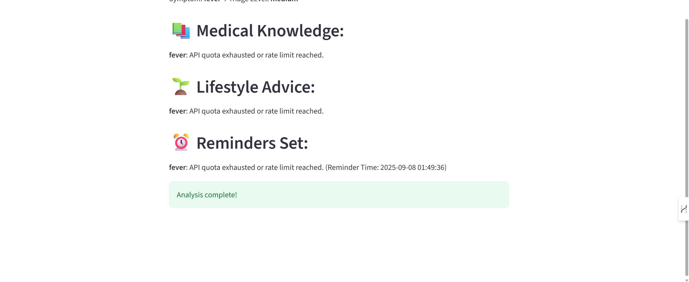

# 🩺 Smart Healthcare Assistant (multi-agent AI system)

A multi-agent AI-powered healthcare assistant designed to help users understand their health symptoms, receive simple medical explanations, get lifestyle advice, and manage health reminders — all in an easy and automated way.

---

## 📝 Problem Statement

Many people face difficulty in interpreting their symptoms correctly or taking the right actions without consulting a healthcare professional. This can lead to confusion, unnecessary worry, or ignoring important health care steps.  

The goal of this project is to build an intelligent assistant that helps users by:
- Analyzing their symptoms
- Explaining medical information in simple terms
- Giving useful lifestyle advice
- Setting reminders to track their health

Using multiple specialized AI agents makes the system efficient, easy to maintain, and scalable. Each agent performs a dedicated role, and the overall system orchestrates them to work together smoothly.

---

## 🛠️ Technologies Used

- **LangChain** 
  Simplifies the management of prompts and chains for handling multiple tasks with the OpenAI API.

- **OpenAI GPT-3.5**  
  Generates medical explanations and lifestyle advice in an understandable way.

- **Streamlit**  
  Provides an easy-to-use web interface where users can interact with the system.

- **Python Dotenv**  
  Securely stores sensitive information such as API keys.

- **SQLite**  
  Stores user reminders locally for easy access and persistence.

---

##  How the System Works

1. The user enters symptoms via the Streamlit web interface.
2. The **OrchestratorAgent** manages the workflow and coordinates other agents.
3. The following agents are involved:
    - **SymptomCheckerAgent**: Analyzes the symptoms and determines the triage level.
    - **MedicalKnowledgeAgent**: Uses LangChain and OpenAI to explain medical terms simply.
    - **LifestyleCoachAgent**: Provides actionable lifestyle advice for the symptoms.
    - **SchedulerAgent**: Saves reminders related to the symptoms and advice into the database.
4. Results are displayed back to the user in a clean, readable format.

---

## ⚙️ Setup Instructions

1. Clone the project repository:
    ```bash
    git clone https://github.com/your-username/smart-healthcare-assistant.git
    cd smart-healthcare-assistant
    ```

2. Set up a virtual environment:
    ```bash
    python -m venv venv
    # Activate it
    venv\Scripts\activate      # Windows
    source venv/bin/activate   # macOS/Linux
    ```

3. Install dependencies:
    ```bash
    pip install -r requirements.txt
    ```

4. Create a `.env` file in the root folder and add your OpenAI API key:
    ```
    OPENAI_API_KEY=your_openai_api_key_here
    ```

5. Run the web app:
    ```bash
    streamlit run app/streamlit_app.py
    ```

---

## 📁 Project Structure

````

smart-healthcare-assistant/
│
├── app/
│   └── streamlit\_app.py            # Main interface code
│
├── agents/
│   ├── symptom\_checker.py          # Symptom analysis agent
│   ├── knowledge\_agent.py          # Medical knowledge generation agent
│   ├── lifestyle\_agent.py          # Lifestyle advice agent
│   └── scheduler\_agent.py          # Reminder scheduling agent
│
├── orchestrator.py                 # Manages agent coordination
├── database.sqlite                 # SQLite database for storing reminders
├── .env                            # Stores OpenAI API key
├── requirements.txt                # Python dependencies
└── README.md                       # Project documentation





## (Optional Improvements)

- Switch to GPT-4 for more accurate medical insights.


